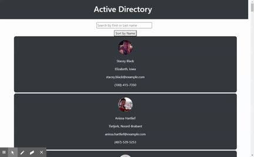

# Active Directory

### Descritption

Using random Employee API I created a employee manager app using React to practice my skills on react

### Installation

required installation
do "npm i" to install required node modules

### Usage

For filtering and searching employee

### Table of Contents

[Description](###Descritption)

[Installation](###Installation)

[Usage](###Usage)

[License](###License)

[Contributing](###Contributions)

[Tests](###Tests)

### License

License under [MIT License](License)

### Contributions

NA

### Tests

NA

### Questions and Suggestions

Feel free to check out my Github:

[github.com/francisN21](https://github.com/francisN21)

You can reach out to me for questions and suggestions at ininorones@gmail.com
